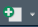
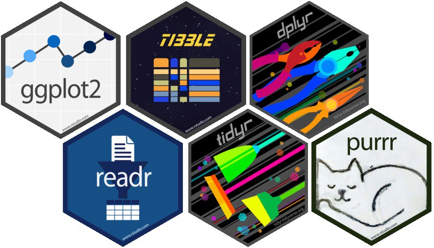

# (PART) First Steps {-}

# Intro and Installation

```{=html}
<script src="https://kit.fontawesome.com/0e67562c4f.js" crossorigin="anonymous"></script>
<!-- <link rel="stylesheet" href="./img/fontawesome.min.css"> -->
```

If you have no prior experience with R, the different names can get a little bit confusing.
There is R, but there is also R Studio and the two serve different purposes in your workflow.
So in the following I will try to make a clear distinction and guide you through the installation of both R and R Studio.

```{r echo = F, fig.cap="R and R Studio as a schematic. R Studio is the 'pretty frame' for R, which can and should be used with packages that in turn contain different functions. The 'tidyverse' is included as a special teaser - it is a meta-package which has many packages that follow a similar workflow and logic."}
knitr::include_graphics("./img/R_scheme.png")
```


## What is R? What is R Studio?

First of all, R is a programming language for statistical and data analysis.

It is open source, which means anyone can contribute - an many many many people do.
Like a lot of other programming languages, R can be used with the functions that it understands without any further instructions - we call this base R - or you can use _packages_ - think of them as new tricks that you can teach your R.

That might all sound intimidating at first but more than anything else it means that means that R follows instructions.
The slightly tricky part is learning how to give those instructions.


## Installing R and R Studio

- Download & Install the newest `r version$version.string` at [https://cloud.r-project.org/](https://cloud.r-project.org/){target="_blank"}
- Download and install R Studio at [https://posit.co/download/rstudio-desktop/](https://posit.co/download/rstudio-desktop/){target="_blank"}

R as a language can be used on its own.
However, it is not very modern, quite hard to use and frankly just no fun.
That's why we use R Studio as a user interface to run R.
Think of it as dipping your fingers in a pot of ink to write versus using a pen and paper - you will still write with the same ink, but the whole process is just nicer.

### Workflow

You can give instructions or *commands* as they're rather called through the **Console** (bottom left tile) or in a Script in the **Editor** (top left tile).
The way to choose which one you want is fairly simple:

-   **Console**: If you quickly want to try a command, you need to install a package or you want to gather information about things like your working directory (we'll get to that later), then you want to use the Console. These are things that we do maybe once per session but usually don't need to reproduce.
-   **Editor**: For pretty much everything else, we want to use the Editor. Here, we can create ***Scripts*** where we can save all the code that we write to use and find again any time.

For most things - especially during the learning phase - it makes sense to write a Script in the Editor in order to be able to save and access the work.
To do so, simply click the {#id .class width=auto height=16px} button and choose 'R Script'.

Once we have a new script created, we can learn some basic things that R is capable of and save it to check out later.
Let's try to use R as a calculator first. 
In the _code chunk_ below you will find some mathematical operations and their respective output.
Here as well as in other places that show R code (such as forums, blogs or help pages) you can recognize a code chunk by its gray background and mono space formatting. 
Output is presented with the `[1]` at the start of the line.

#### Basic Math {-}

```{r basicbasics, collapse = T, comment = " "}
1+2 
2-3
3*4
4/3
5^2
```

#### Assigning Values {-}

```{r basicbasics2}
a <- 3
b <- 4
a-b
a*b+5
```

In these code chunks, R is essentially being used as a calculator to perform basic math.
While we want to make use of all the more powerful functions of R, it is important to grasp the basics and be able to use arithmetic for our purposes.
Next to the basic mathematical operators, there are many nifty mathematical functions, such as `sqrt()` - _square root_, `sum()` or `pi`. 

We also added **variables** containing values (here a and b hold values 3 and 4 respectively) that can be used in the calculations just like the values they contain.
As they only contain numbers, the variables a and b are called **numeric**.
We can check this property of a variable, e.g. `a` using the function `class(a)`, which gives us "`r class(a)`" as output.

Usually when we fire up R, we don't just want to work with single values numeric but with **data frames** or **vectors** {#id .class width=auto height=20px} that can contain different classes of variables and several values respectively.

#### Vectors{-}

```{r advancedbasics}
v <- c(6, 7, 8)
class(v)
d <- c("sunny", "rainy", "foggy")
class(d)
```

#### Data Frame {-}

```{r}
e <- data.frame(v, d)
class(e)
e
```

Notice that we did not just add all values one after the other, but followed a certain notation that begins with the function `c()`.
The c stands for "combine" or "concatenate" and tells R that all following values belong to the same variable.
There are several ways of adding variables to a data frame, but the `data.frame()` command is the simplest.

<!-- ::: {.awesomeblock data-latex="[lightgray]{2pt}{\faLightbulb[regular]}{violet}"} -->
> All values in a variable should have the same class. 
> Go ahead and try out `hm <- c(3, "sunny", 5.2)` and check the class. 
> What happened - did you expect that?


When we have our data in a neat data frame, what we usually want to do is access either certain **rows** or **columns**.
To do so, base R uses square brackets `[]` behind the name of a data frame to indicate "take this data, but only certain rows/columns/cells".
Remember: The brackets understand the first input as rows and the second as columns - _rows right away_.

#### Square Bracket Indexing {-}

```{r brackets}
e[1, ]
e[ , 1]

weather <- e[ , 2]
weather

e[1, 1]*e[2, 1]
```

Our data set `e` contains three numbers in column c and different strings in column d.
We can select just the first row, or just the first column or either of the other rows and columns that we have in the data.
We can also re-assign the values, e.g. to a new variable named "weather" or perform calculations on single cells in the data frame - only if they contain numerics, of course.

<!-- ::: {.awesomeblock data-latex="[lightgray]{2pt}{\faLightbulb[regular]}{violet}"} -->
> With square brackets we can only index rows and columns that are present in the data.
> That maybe sounds obvious, but can easily lead to confusion because of error messages! 
> What happens when you try to index `e[,3]`?


While it is common practice to work with data frames and edit them according to our tasks and needs, using square brackets and base R can get a bit humdrum.
Luckily, many many people have developed many many packages that contain different functions, helping us in most tasks that we will need to tackle! 

## Installing Packages 

{height=60px}

Most packages are available on CRAN - the Comprehensive R Archive Network.
That being the case you can easily install the package you want to have with the command `install.packages("packagename")`.
It is important to note that the package name must be in quotes for the installation, while loading it into a script works without quotes using `library(packagename)`.

Packages usually serve quite specific purposes, e.g. ones we will later get to know are `dplyr`, with which data handling is made a lot easier and more intuitive and `ggplot2`, which allows us to create beautiful, publication-ready plots and visualizations.
What is special about these two, among some others, is that they were developed by the same person (Hadley Wickham), and are made available in a sort of "meta package" - the `tidyverse`. 
Installing and loading the `tidyverse` makes the functions from many different packages available at once.
This is quite convenient when we want to use a lot of those packages in the same session or script, but does also take a longer time to load and is sometimes not actually necessary.

To use this package of packages, please install the `tidyverse`, using `install.packages("tidyverse")` in the console and then load it into your script (or, again, directly in the console, bottom-left) with `library(tidyverse)`.
You can test whether it works by running `iris %>% pull(Sepal.Length) %>% mean()` in your console.
We will get to know the syntax in depth another time, but just so you know what's going on:
This line of code takes the data set `iris`, which is included in R by default, "pulls" the variable `Sepal.Length` out of the data and runs the `mean()` function on it, to calculate the average sepal length, which should be `r iris %>% pull(Sepal.Length) %>% mean()`.

### Posit Cloud {-}

If you would like to be able to use R with several devices or simply want to start out and see what all the fuss is about, you can use the free online version of R Studio over at [https://posit.cloud/](https://posit.cloud/){target="_blank"}.
There, you can do most anything that you can also do locally on your own machine, online.
It's a great way of working with R online without any commitment.

However, if you plan to really learn R or also if your teacher plans you really learn R, I would recommend following the above steps to use it your own computer.
Some calculations or operations can require a bit more computation power that might be slower via the internet.


## Wrap-Up & Further Resources {-}

<i class="fa-solid fa-anchor" style="color: teal;"></i>
<ul style="color: teal;"> 
<li> R is a powerful language, R Studio is the user interface we use with it</li>
<li> R can be a calculator and perform basic and advanced math</li>
<li> We mostly work with variables and data frames </li>
<li> Packages make working with R easier and more fun!</li>
</ul>

<br>

<i class="fa-solid fa-book" style="color: orange;"></i>
<ul style="color: orange;">
<li> [Tadaa Data: R für Psychos (german)](https://r-intro.tadaa-data.de/index.html){target="_blank"} </li>
<li> [Kaggle: Intro to R](https://www.kaggle.com/code/hamelg/intro-to-r-part-4-variables){target="_blank"}  </li>
<li> [Tidyverse](https://www.tidyverse.org/){target="_blank"} </li>
</ul>
