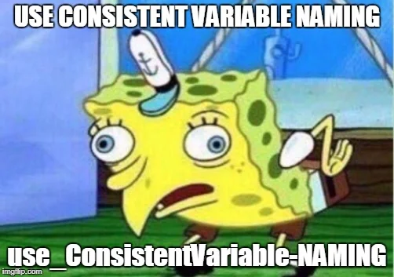
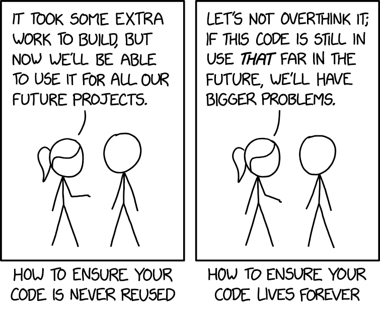
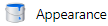

# Best Practice

```{=html}
<script src="https://kit.fontawesome.com/0e67562c4f.js" crossorigin="anonymous"></script>
<!-- <link rel="stylesheet" href="./img/fontawesome.min.css"> -->
```


<!-- **What is Best Practice?** -->

> " ~~All~~ Many roads lead to Rome"

You can achieve most things in many different ways - _best practice_ refers to the best/ easiest/ clearest way of working with R.
Some of the things you will read about might not make sense to you intuitively and that's ok.
Realistically, there are some mistakes that everyone must make for themselves.
When you do, I just want you to remember that here is some advice that you have either heard before or will read up on now to get out of the pickle you may be in!
Maybe you would like to bookmark the [toolbox](#toolbox) to always find an overview of nifty tips, tricks and hacks?


## Naming Conventions {#varnames}

R is a so-called *object-oriented* language.
What that means for us is mostly that all our data exist as "objects" as far is R is concerned.
Just like in real life, we can *do* stuff with those objects now, which is called using a *function* or *command*.
Which brings me to the importance of proper names for all your variables, data sets, functions...
Everything.

If we go to the market and I tell you to get me an apple, you will probably be confused if there are many types of apples, maybe different colors, maybe different breeds.
Basically, if I don't specify which apple I want, you are not able to pick out the right one.
The same is true for R: If you try to call a function but fail to specify what object to use the function on, R is confused and throws you an error.

Now, this may seem pretty obvious but it is a pretty common source of errors, especially during the "steep phase" of the learning curve.
In R, `abc` is a different object than `ABC`, which is different from `a_b_c`, which is different from `A.B.C`. All of these variants are possible ways of naming your objects in R.
However, it makes everyone's life significantly easier to stick to some naming-guidelines.

- Preferably use **lower-case** variable names, e.g. `gender` instead of `Gender` or `GENDER`.
- Preferably use an **underscore** to differentiate between different words in your object names if necessary, e.g. `music_preference`.
- **Avoid using numbers** in your names because likely either you or R will get confused with this at some point, e.g. `raw_data` instead of `data1`[^1].
- Use **abbreviations** where useful, e.g. `rt` instead of `reaction_times`.
- Use **names that will still make sense** to you in the future, i.e. avoid names like `asdf_data` or `blibblobfundata`. The best case scenario would be that your variable names also makes sense to other people if they try to understand your code!

[^1]: Additionally, the 1 (one) and the l (lower-case L) can look very similar, which makes thing just even worse when trying to figure out an error.

I will admit that some of these pieces of advice are more opinionated personal experience than objective facts.
The more you work with variables and maybe also code from other people, you may form your own opinions on what the best naming conventions are for you.
I strongly suggest finding a way that works for you and sticking with it.
As I described above, I personally will try to stick to *lower_snake_case* to name my variables because it is usually very clear, easy to read by humans and computers and would also be usable in any other programming language. <i class="fa-solid fa-worm" style="color: green;"></i>

Another thing that can take some time to get used to is avoiding white spaces in file names and any other names, for that matter.
R has problems finding files with names such as "My file with a really specific name.bib", which can easily be avoided by sticking to snake_case: "My_file_with_a_really_specific_name.bib". 
The same goes for variables: In my first class, we discovered that it is possible in R to set a variable name with a space. 
Just because it's possible does not mean anybody should do it. Ever. 

You can try it out: Enter `"hi there" <- 5` in your console to assign the value 5 to a variable named `hi there`. 
You will see it appear in your working environment, but accessing the variable is virtually impossible.
If you just type `hi there` in the console and hit Enter, R will give you an error à la _"unexpected symbol"_.
But if you type `"hi there"`, it will echo the text back to you.


{height=200px}
<figcaption style = "font-size: 7pt;">https://www.reddit.com/r/ProgrammerHumor/comments/6stwag/can_you_stick_to_any_naming_convention/</figcaption>


Here is a list of positive and negative naming examples:

- `great variable`
    -  <i class="fa-solid fa-circle-xmark" style="color: red;"></i> Spaces can technically work but are a hassle to access
- `Areallysuperinsanelyverylongvariablename`
    -  <i class="fa-solid fa-circle-xmark" style="color: red;"></i> Variables are supposed to _reduce_ workload
- `Howaboutthis$`
    - <i class="fa-solid fa-circle-xmark" style="color: red;"></i> Special characters should be avoided
- `age_grouped`
    - <i class="fa-solid fa-check" style="color: green;"></i>
- `GenderRecoded`
    - <i class="fa-solid fa-check" style="color: green;"></i>
- `aMAZING¯vARIABLE¯nAME`
    - <i class="fa-solid fa-circle-xmark" style="color: red;"></i>  Please just no. <i class="fa-solid fa-circle-xmark" style="color: red;"></i> 
    

## Exercise: Creating Data

Imagine we are going to measure some test scores at a school that are supposed to reflect the kids' IQ (mean 100, sd 15). 
In order to prepare for data analysis, we want to simulate what the data might look like beforehand. 

We are going to measure their age and IQ score and we will be assessing class 7a and 7b.

Create **two data frames** - one for each class. <br>
They should each contain **n = 20 entries** (for 20 kids) and **2 variables i.e. age and IQ score**. 
We assume **age is a random number from 12 to 15** and **IQ follows normal distribution with mean = 100, sd = 15**.

Afterwards, add a variable to code the **class** to each data frame and add them together **underneath each other**.

<!-- Board functions: data.frame, sample, rnorm, $, rbind, str -->

`r hide("Which functions should I use?")`

The functions you will need are _data.frame, sample, rnorm, $, rbind_ and _str_. 
You can read help on any function by typing a question mark before the function name in your console and hitting Enter, e.g. `?rnorm`.

`r unhide()`


`r hide("Solution")`

```{r iqscores}
# Create the data frames
scores7a <- data.frame(age = sample(x = 12:15, size = 20, replace = T),
                       iq = rnorm(n = 20, mean = 100, sd = 15))

scores7b <- data.frame(age = sample(x = 12:15, size = 20, replace = T),
                       iq = rnorm(n = 20, mean = 100, sd = 15))
# Notice anything about the code?

str(scores7a); str(scores7b)

# Add information about the class
scores7a$class <- "7a"
scores7b$class <- "7b"

# create big dataframe
allscores <- rbind(scores7a, scores7b)

# Check the overall data frame for plausibility
str(allscores)
table(allscores$class)
```

`r unhide()`


## Working Directories

A working directory corresponds to the folder on your computer that you are **working in**.
It is similar to when you open up a program such as Word and then locate a file that you wish to open there - you need to find the folder on your machine where that file is located.
With R, we usually either just open up R Studio or we will directly open a script. 
Commonly, the working directory will either be the default folder (e.g. "Documents" on Windows) or if you open up a script from a specific location, it might also be set to that folder automatically. 
Vice versa, if you work on a script in R Studio and save it, it will saved in the folder that is currently set as the working directory.

You can check your current working directory by entering `getwd()` in the console.
It will output a so-called file path that "explains" which folder your are working in.
In the default view of R Studio you can also find the "Files" tab in the lower right corner and it will show the contents of your current working directory.
If you want to change the working directory you can use the command `setwd()` and enter a file path in the parentheses.

> Try it out: Execute the getwd() command in the console. <br>
> Which folder is R working in - is it the one you expected?

While this way of structuring your work in folders and directories is very common, it can pose some issues down the line.
Usually, we will work with our own data files (see Chapter \@ref(#exdata)) and read them into our script to use them for analyses.
If they happen to be in a different folder than our working directory, we will need to use the complete file path to tell R where to find this data file.
When we now ask someone else to try out the code - either because we need help or because we are handing in an assignment - they will raise an eyebrow because chances are that they do not have the specified file path available on their machine.

> [1] "C:/Users/Tave/great_projects/my_specific_folder_name"

The same goes for us if we ever want to use a different machine, e.g. for work. 
Moreover, it is quite easy to forget which folder you are currently working in, which means it can get hard to later locate your scripts again.

This may all sound like quite the hassle, but luckily there is a simple solution built right into R Studio that will make self-organization easy.

## R Projects {height=30px}

A project in R is essentially a bookmark to a specific folder on your computer. 
It lets you organize your projects very clearly, so you can e.g. create a folder for your thesis where you save the data you collected and the R scripts to wrangle that data.
When you open the R project it automatically sets your working directory to the folder you put the project in.
It also makes it easier for you to use so-called _relative file paths_, allowing you not to specify a full file path when you want to reference a data file or maybe a BibTex file that contains citations for a paper or thesis. 
With a relative file path you can use a period as a placeholder for "current folder/working directory" and then just specify the path from there.

> Let's try that out under `File` $\rightarrow$ `New project...`

This is also great for sharing your code and projects: 
If someone else has the same data file in their R project then they will be able to use your scripts containing just the relative path and be able to execute the code.

 {height=200px}
 <figcaption style = "font-size: 7pt;">https://xkcd.com/2730/</figcaption>

Next to all advantages with sharing as well as creating reproducible code, working with R projects will also help you in keeping your workflow organized. 
In the following, you can try to create your own R project and see how to use the relative file path!

### Exercise {-}

<!-- # ```{r eval = F, include = F} -->
<!-- # data <- readr::read_csv("C:/Nextcloud/Lehre/Seminar_PsychResearchR/data.csv") %>%  -->
<!-- #   select(observing:gender) %>%  -->
<!-- #   mutate(gender = factor(gender, levels = c(1, 2, 3), labels = c("male", "female", "other"))) -->
<!-- #  -->
<!-- # saveRDS(data, "mindfulness_data.Rds") -->
<!-- # ``` -->

1. Create a subfolder called "data" in your R project.
2. Download the file "mindfulness_data.Rds" from [GitHub](https://github.com/the-tave/psych_research_in_r/blob/main/data/mindfulness_data.Rds) and save it in that folder.
3. Now try to load it into your script and check whether it worked by executing this code:

```{r}
mindful <- readRDS("./data/mindfulness_data.Rds") # relative filepath
str(mindful)
```

{height=200px}
<figcaption style = "font-size: 7pt;">https://www.reddit.com/r/ProgrammerHumor/comments/11a1fqi/code_reuse/#lightbox</figcaption>


## Make R your own

So far, you have learned about many important aspects of getting used to a productive and efficient workflow.
However, in my experience the best basis for a good workflow means nothing if it is not really fun to use said flow.
Therefore, I want to introduce you to a really nifty feature in R Studio: customizing the appearance.

> `Tools` $\rightarrow$ `Global Options` $\rightarrow$ `Appearance` {height=30px}

Because honestly? it's fun, and if a program is fun you will want to use it more.
And practice is is the best way of learning any new skill. <i class="fa-solid fa-crown" style="color: yellow;"></i> 

There are many different "themes" for R Studio to choose from.
You can control not only what the interface looks like but also how code is displayed.
This can be especially helpful if you have a hard time differentiating colors - you can look for a theme that makes it easier for you! 
Most themes also have some rules for coloring numbers differently than text differently than function calls an so on.
So it is not just a nice add on but can actually be really helpful and improve accessibility.
Personally, I work really well with the `Merbivore` theme - what is your favorite?


## Wrap-Up & Further Resources {-}
 
<i class="fa-solid fa-anchor" style="color: teal;"></i>
<ul style="color: teal;"> 
<li> Stick to naming conventions for R objects and related files </li>
<li> Make sure your working directory is correct </li>
<li> Use R projects to organize your scripts easily </li>
<li> Make R fun and appealing to use FOR YOU! </li>
</ul>

 <br>
 
<i class="fa-solid fa-book" style="color: orange;"></i>
<ul style="color: orange;">
<li> [R Projects: A quick overview](https://thedavidchen.github.io/post/rstudio-why-use-projects/) </li>
<li> [Starting your R projects](https://bookdown.org/daniel_dauber_io/r4np_book/starting-your-r-projects.html) </li>
<li> [RStudio Projects and Directories](https://martinctc.github.io/blog/rstudio-projects-and-working-directories-a-beginner's-guide/) (rather thorough) </li>
<li> [Some ideas on improving your workflow](https://www.tidyverse.org/blog/2017/12/workflow-vs-script/) (this can seem a bit advanced, but try reading through anyway and see what sticks with you. Building good habits at the beginning of your learning journey will make your life a lot easier down the line!)
</ul>

## Working with Version Control {-}

...can sound scary and daunting to learn.
I believe this to be a more advanced feature which is a bit much for a (non-programmer) beginner, so I will mention it last.
However, using version control systems such as [GitHub](https://github.com/) can be really great to keep track of your work, share with others and also ask for help. 

If you want to start learning about Git and GitHub, I suggest [starting your journey](https://docs.github.com/en/get-started/start-your-journey/about-github-and-git) directly on the GitHub Docs webpage.
For those who may already have some experience, here is a nice blog article bringing up some of the slips and falls one might take when working with GitHub: [Hack your way to a good Git history (Maëlle Salmon)](https://www.r-bloggers.com/2024/06/hack-your-way-to-a-good-git-history/).
