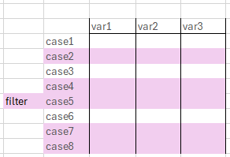

# `tidyverse`: Data munging with `dplyr` {#dplyr}

```{=html}
<script src="https://kit.fontawesome.com/0e67562c4f.js" crossorigin="anonymous"></script>
<!-- <link rel="stylesheet" href="./img/fontawesome.min.css"> -->
```

In this chapter you will learn about working with packages, which I find similar to teaching your R new tricks. 
I will also introduce you to the `tidyverse` - a collection of packages and why I strongly suggest to familiarize oneself with a bunch of them.
Spoiler: It will make your life a lot easier.

## Working with packages <i class="fa-solid fa-dragon" style="color: darkred;"></i>

First off, when you stick to the metaphor a package being a collection of tricks to teach your R, then you will teach the tricks once and remind R that it knows the tricks every time you want to use them.
In more real life terms, you will install a package once and load it in each new session.
This is important to remember because installing packages is one of the few things you will _only_ want to do in your console - NOT in any of your scripts.
Nothing bad will happen if you do, but it takes a very long time and it will test both your own patience and that of your computer.

- install packages with `install.packages()` 
    - Only once in the console!
- load packages with `library()` 
    - Every time you load a script or start a new session 
    - Usually in the script, but also in the console
- Specific function from a package: `package::function()`
    - Use if you just need that one function once and don't want load the entire package 
    - Or to explicitly show the according package
    - Or the function name is also in other packages (e.g. "filter" is usually `dplyr::filter`, but sometimes `stats::filter`)
    


### Incomplete List of Useful Packages
#### For Reference

<br>

Package Name | General Purpose
------|-----
psych | Advanced statistical testing / modeling e.g. factor analysis
tibble | Alternative for creating data frames
tidyr | Clean up daata & simple reshaping
dropR | Dropout analysis (by experimental condition)
foreign | Handling data from SPSS
corrplot | Create correlation plots/ matrices

### The tidyverse

"The tidyverse is an opinionated **collection of R packages designed for data science**. All packages share an underlying design philosophy, grammar, and data structures." [tidyverse.org](tidyverse.org) <br><br>

- The features are very intuitive and clear
- It is easy and makes sense to combine several features of those packages
- We will focus on aspects of _literal everyday use_: 
    - Clean up data aka. data wrangling $\rightarrow$ <span class="fragment highlight-red"> `dplyr` </span>
    - Visualize data for overview or reporting $\rightarrow$ `ggplot2`

## What is `dplyr`? 

{height=80px}


- Probably the best and most important package in R
- Powerful tool for editing data in data frames
- Great way to keep your workflow clear and reproducible
- Very intuitively named functions

- `install.packages("dplyr")` $\rightarrow$ `library(dplyr)`


### Most important `dplyr` functions

<!-- :::{.incremental} -->

- `select()`: select certain columns by name
- `filter()`: filter values from a column/variable
- `rename()`: rename a variable
- `mutate()`: change values of a column (new or existing)
- ` %>% `: "pipe" brings data from previous operation to the next (Shortcut: Strg + Shift + M)

- Cheatsheet: [https://github.com/rstudio/cheatsheets/blob/main/data-transformation.pdf](https://github.com/rstudio/cheatsheets/blob/main/data-transformation.pdf)

<!-- ::: -->

## Intro to the exercise 

{height=150px}

- Remember the `iris` data set? 
    - contains information on iris flowers of different species
    
```{r}
glimpse(iris)
```

### Imagine...

<br>

- We only want data from species "virginica" 
- We are interested in in sepal length
- We want to adjust variable names 

<i class="fa-solid fa-seedling" style="color: purple;"></i>

### First Example 

```{r dplyr}
iris_virginica <- iris %>% # 1. create new data set as copy
  filter(Species == "virginica") %>% # 2. only virginica
  select(Petal.Length, Species)  %>% # 3. select columns 
  rename(plength = Petal.Length) # 4. rename variable/column

head(iris_virginica)
str(iris_virginica)
```

### Filter 

{height=100px}

- Filters data by a **value in a variable**
    - With filter we **keep only certain rows** in our data
- Needs **logical operators** as input
    - "keep only cases where variable x has value abc"
    - Can also be used with the ! to drop certain cases
    - Drop NAs: `data %>% filter(!is.na(variable))`
    
### Select 

{height=100px}

- Selects **variables based on their names**
    - With select we **keep only certain columns** in our data
- Needs **variable names** as input
    - "keep only variables with this name"
    - Can also be used with the ! to drop certain variables
- Cave: if we want to extract one variable to calculate something, you will want to use `pull()` instead
    - Check `iris %>% select(Species) %>% class()` and `iris %>% pull(Species) %>% class()`

### Mutate


- We also want the species to be capitalized in our data 
- We also want to add a new binary variable for whether a flower's petals are longer than 5.5 cm (1) or not (0)
    - for this, we use the `ifelse()` function:
    - Needs a logical as first input, then what to do if it's true, last what to do if it's false
    
- Mutate takes a **variable name as input** (existing or new) and some **function or calculation** to be done on that variable


```{r mutate}
iris_virginica <- iris_virginica %>% 
  mutate(Species = toupper(Species),
         bigboi = ifelse(plength > 5.5, 1, 0))
head(iris_virginica)
table(iris_virginica$Species)
```


## Exercise

Imagine we want to edit the iris data set for our american colleagues, who are interested in the petal width of the **setosa** and **versicolor** species. <br>

1. Create a new dataset from `iris` with a meaningful name
2. `select()` the variables of interest
3. `filter()` the species that we want
    - Use %in% to filter by more than one value, or think about a reverse approach...!
4. `rename()` the Petal.Width variable to be named pwidth
4. Use `mutate()` to add a new variable named "pwidth_inch", which contains the petal width in inches
    - Calculation: pwidth / 2.54 (2.54 cm = 1 inch)


### Solution

```{r inch}
iris_twospec <- iris %>% 
  select(Petal.Width, Species) %>% 
  filter(Species %in% c("setosa", "versicolor")) %>% 
  # or: filter(Species != "virginica")
  # or: filter(Species == c("setosa" | "versicolor"))
  rename(pwidth = Petal.Width) %>% 
  mutate(pwidth_inch = pwidth / 2.54)

head(iris_twospec, 8)
```


 
<!-- <figcaption style = "font-size: 7pt;">Hadley Wickham, developer of the tidyverse</figcaption> -->


## On a Tangent: `magrittr` pipe %>% 

- The pipe keeps our code readable and tidy
- It allows us to keep edits in separate lines, but we still only have to run one command for every task we need
- It's easy to add new commands by using another pipe operator, or to leave edits out but commenting out the respective line of code
- Most things can be achieved with or without pipe

### Example

```{r pipe}
# With pipe - clear
iris_edit <- iris %>%
 filter(Petal.Length > 3) %>% # only big petals
 select(Species, Petal.Length, Sepal.Length) %>%  # only those columns
 mutate(random_calculation = Petal.Length * Sepal.Length) # calculate random new variable

# Without pipe - a lot of typing, prone to error, annoying to debug
iris_edit2 <- filter(iris, Petal.Length > 3)
iris_edit2 <- select(iris_edit2, Species, Petal.Length, Sepal.Length)
iris_edit2 <- mutate(iris_edit2, random_calculation = Petal.Length * Sepal.Length)

# Are the two versions equal?
all.equal(iris_edit, iris_edit2)
```

<!-- :::{.incremental} -->

<!-- -  -->
<!--   ```{r } -->
<!--   # With pipe - clear -->
<!--   iris_edit <- iris %>%  -->
<!--     filter(Petal.Length > 3) %>%  -->
<!--     select(Species, Petal.Length, Sepal.Length) %>%  -->
<!--    mutate(random_calc = Petal.Length * Sepal.Length)  -->
<!--   ``` -->
<!-- -  -->
<!--   ```{r } -->
<!--   # Without pipe - lots of typing & error -->
<!--   iris_edit2 <- filter(iris, Petal.Length > 3) -->
<!--   iris_edit2 <- select(iris_edit2, Species,  -->
<!--                         Petal.Length, Sepal.Length)  -->
<!--   iris_edit2 <- mutate(iris_edit2,  -->
<!--           random_calc = Petal.Length * Sepal.Length) -->
<!--   ``` -->
<!-- -  -->
<!--   ```{r} -->
<!--   # Are the two versions equal? -->
<!--   all.equal(iris_edit, iris_edit2) -->
<!--   ``` -->

<!-- ::: -->


### Brainteaser <i class="fa-solid fa-lightbulb" style="color: yellow;"></i>

- In the part with pipe we used the `iris` data to edit and assigned it to `iris_edit`
- In the part without pipe we used `iris` in the first line, but afterwards we used `iris_edit2` for assignment and edit

- Why is that? 

### How to pipe for base-R


- Pipe helps us not to drown in parentheses when conducting analyses, e.g. calculating a mean after filtering 
  - It makes code longer but still easier to read
- 
  ```{r parentheses}
  # Without pipe
  round(mean(iris$Petal.Length[iris$Species == "setosa"]), digits = 2)
  ```
-
  ```{r}
  # With pipe
  iris %>% 
  filter(Species == "setosa") %>% 
  pull(Petal.Length) %>%
  mean() %>% round(digits = 2)
  ```
  


### Brainteaser <i class="fa-solid fa-lightbulb" style="color: yellow;"></i>

We want to edit the iris data to rename a Petal.Length to pl and mutate it to be multiplied by ten.

Why does the first version work, but not the second one?

```{r eval = FALSE}
# Version 1
iris %>% 
  mutate(Petal.Length = Petal.Length * 10) %>% 
  rename(pl = Petal.Length) %>% 
  glimpse()

# Version 2
iris %>% 
  rename(pl = Petal.Length) %>% 
  mutate(Petal.Length = Petal.Length * 10) %>% 
  glimpse()
```

<!-- Can be skipped if we don't have time -->
## group_by & summarize 

- With the dplyr-workflow, we can easily output group statistics
- Keywords: **group_by()** & **summarize()**
- The code is built like any other dplyr workflow with pipes ( %>% ) in between each:
    1. Define/ name the data frame
    2. group_by(_variable_name_)
    3. in summarize, define a name for the statistic, use a =, use a function like mean() for the measure
    
### Example: group_by & summarize

```{r}
names(Orange) # use different default data set

Orange %>% 
  group_by(Tree) %>% 
  summarize(m_age = mean(age),
            m_circumference = mean(circumference),
            n = n())
```
    
### Exercise: group_by & summarize

<br> 
Follow the structure to group the iris data set by Species and output a summary with the mean values of all four other variables in the data. <br> 
Also include the grouped n.

### Solution

```{r}
iris %>% 
  group_by(Species) %>% 
  summarize(m_plength = mean(Petal.Length),
            m_pwidth = mean(Petal.Width),
            m_slength = mean(Sepal.Length),
            m_swidth = mean(Sepal.Width),
            n = n())
```


## Wrap-Up & Further Resources {-}
 
 <br>
 
<i class="fa-solid fa-anchor" style="color: teal;"></i>
<ul style="color: teal;"> 
<li> Packages make working with R easier</li>
<li> `dplyr` is a powerful tool for editing data (_select, filter, mutate..._)
<li> The pipe %>% makes your code clearer and "follows the thought process" </li>
</ul>


<br>

<i class="fa-solid fa-book" style="color: orange;"></i>
<ul style="color: orange;">
<li> [R for Data Science](https://r4ds.hadley.nz/) Book </li>
<li> [dplyr vignette](https://dplyr.tidyverse.org/) </li>
<li> [YouTube: 20 R Packages that you should know](https://www.youtube.com/watch?v=npOf6aXdguY&ab_channel=RichardOnData) - you for sure don't need them all, but there are some nice inspirations for working with packages in there </li>
</ul>

{#id .class width=auto height=400px}
