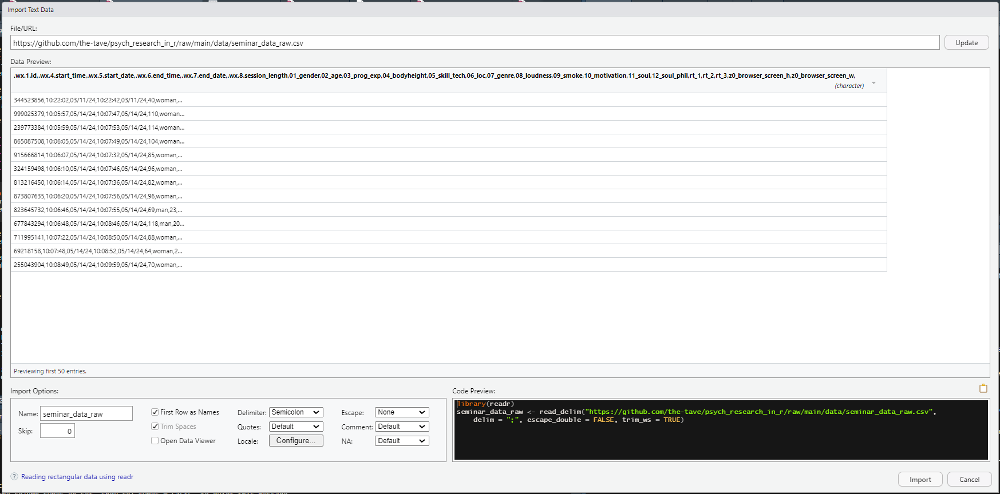

# (PART) The Nitty-Gritty {-}

# Working with existing Data {#exdata}

```{=html}
<script src="https://kit.fontawesome.com/0e67562c4f.js" crossorigin="anonymous"></script>
<!-- <link rel="stylesheet" href="./img/fontawesome.min.css"> -->
```

After learning how to get your data to be the right format and how to look at said data, it now gets down to the nitty-gritty.
In this chapter we will talk about where data can come from and how to get it inside of R. 
For that, we will talk about different ways of reading data into R to get the right format and also some first steps that should be taken with data in order to work with it properly.

We will work with some new packages, so please make sure you have the `readr` package as well as the `wobblynameR` package, which is only available on GitHub. 
To install it, you will first need the `devtools` package and then use it to install from GitHub:

```{r eval = F}
install.packages("devtools")
devtools::install_github("the-tave/wobblynameR")
```

<!-- [https://exp.wextor.eu/TheTave/PsychResearchR/](https://exp.wextor.eu/TheTave/PsychResearchR/) -->

## Different types of data sources

Data collected from [WEXTOR](https://www.wextor.eu) - like from many other sources - will be exported in the CSV format, which stands for comma-separated values.
That means that this type of data has one row per participant and the values for each column (variable) are separated by a _delimiter_ ^[...which often times is a comma, but not always! WEXTOR, for example uses semicolons.].

When our data comes from an Excel file, it will often be exported as CSV because this type of storing data is pretty efficient and uses up very little space on the disk.
A more modern but also more space-consuming way of storing Excel table data is in the XLSX format (Not an acronym, just stands for "Excel Spreadsheet").

Many people use SPSS for statistical analysis and creating dataframes.
These data will be stored in a file with the extension SAV. 
Generally speaking, SAV files are compatible with R.
However, there are some specialties which can cause problems, such as SPSS labels.
We won't go into depth on this, just know that R can sometimes recognize SPSS labelled variables as their own class, in which case the class of those variables should be corrected manually ^[The function calls `as.numeric()` and `as.factor()` will suffice in most cases.].

Finally, of course we can also encounter datafiles that were created in R.
In this case the will have .Rds as the file extension.
A special case of this is when data frames are included in base-R or in a package.
For example, the dataset called `iris` comes with R as an example dataset.

Therefore, we can run a function on it without having to load it at all:

```{r iris}
head(iris)
```

Depending on which type of data we want to work with, there are different ways of loading the data into R.

## Reading in the data

There are two main ways to load data: via the "Import Dataset" menu under the _Environment_-tab or (only) using code and if necessary packages.
In the menu, simply select the option "Import Dataset" menu under the top-right _Environment_-tab and use _From text (readr)_ for csv or other text files (such as .txt).
Note that this menu also offers the possibility to load data from Excel and SPSS.
However, this is much easier done by just using simple commands directly in your script:

Data Source | R command
------|------
WEXTOR (CSV) | `readr::read_delim("data.csv", delim = ";")`
Excel (XLSX) | `xlsx::read.xlsx("data.xlsx", sheetIndex = 1)`
R Data Source (RDS) | `readRDS("data.Rds")`
SPSS (SAV) | `foreign::read.spss("data.sav")`

You can follow along these exact code examples if you download the _seminar_data_raw_ data frame from GitHub and save it in the data subfolder in your R-Project.
You can find it under this link: [https://github.com/the-tave/psych_research_in_r/raw/main/data/PsychResearchR_data.csv](https://github.com/the-tave/psych_research_in_r/raw/main/data/PsychResearchR_data.csv).^[If you are connected to the internet anyway you can also use this link as the file path without downloading the data first!]

{.flr height=60px}

Use the "Import Dataset" Menu under the _Environment_ tab in the upper right corner of R Studio. 
In that menu, there are different options for different operations, but for CSV files I recommend the _From Text (readr)_ option.
Then we can select our data file and choose some basic aspects of reading in that data.

One of the reasons why i prefer this option over others is that a lot of the times it will recognize the data specifications on its own, so when you have selected the data file on you computer and copy out the generated Code from the Code Preview, it will look something like this:

### Generated Code {-}

<!-- # ```{r include = F} -->
<!-- # edited_data <- PsychResearchR_data[, c(1, 4:8, 12:32)] -->
<!-- # edited_data <- edited_data |> select(-starts_with("vi_")) -->
<!-- # write_csv(edited_data, "data/seminar_data_raw.csv") -->
<!-- # ``` -->

```{r eval = F}
library(readr)
seminar_data_raw <- read_delim("data/seminar_data_raw.csv")
View(seminar_data_raw)
```

The `read_delim()` function needs the file path to the data file as the minimum input requirement.
There are many basic edits that can already easily be made in this function, which can also be selected in the menu.
For example, even though "csv" stands for _comma-separated values_ these tiypes of files sometimes use a semicolon as a delimiter.
When reading in the data, this is sometimes recognized automatically, but when the data looks a bit funky in the preview, making sure the right delimiter is selected is a solid first step.



### Basic Edits <i class="fa-solid fa-paintbrush" style="color: darkgreen;"></i>  {-}

There are a lot more quite basic edits that we can achieve from the comfort of the Import Dataset menu.
In this case, we will make explicit some specifications that are automatically recognized, namely `delim = ","` - i.e. the correct delimiter, `escape_double = FALSE` - i.e. double quotes are not treated as a special character^[Escape characters are very important and very confusing. Just know that some special characters can be recognized either as plain text or as a request to do something (as code).] and `trim_ws = TRUE` - i.e. if there are white spaces in the data, they should be trimmed.


We can also specify some column types in this menu.
Most columns will probably be fine staying the type they are automatically recognized as but especially some date formats are not properly recognized by R.
So it makes sense to look through the data preview and do a quick visual check whether the data you see is displayed properly and the values make sense.
If that check reveals that something is wrong, the little gray triangle next to the variable name offers many column types to choose from and find the one that suits your data.
In our example, we will make sure that the start and end date variables are recognized as dates in the right format.
For that we will choose the _Date_ format and trigger a prompt asking for the correct format with some placeholders.
When talking about dates, placeholders like m, d and y should be intuitive enough - suffice it to say that a capital Y stand for the whole year (e.g., 2024) while a small y stands for a shortened year format (e.g., 24).

Another handy column type is `col_skip()` which does just that - skip that specific column.
It may seem strange to exclude some data from the get-go, but some data files will end with a delimiter and R recognizes that as another column.
This is also the case for this data file from [WEXTOR](https://www.wextor.eu), which is why we will skip the last column (which is completely empty).

Moreover, we can take full advantage of both menu and script by copying the code that is generated from the menu into our script. 
This automatically gives us a nice structure to start a new script for analyses with a first library command at the top (for `readr`) and reading in the data as a first step of analysis.
As a best practice, we will change the name of our raw data set in R to "raw".
This data set can remain untouched throughout all other data munging steps which allows us to revise edits or go back a step if something goes wrong with having to reload the data (especially with a big data set, reading it in can take a bit of time).

As a last first step, we will use the `namepref0()` ("name-prefix-zero") function from the `wobblynameR` package to add the prefix "v" to every variable name.
There are different reasons why a consistent prefix might be useful - in this case the variable names start with a number, which can cause problems in R.
The function takes the whole data frame as input and outputs that data frame with all variables renamed, which we will save in a new data frame called "seminar".
The resulting code - the first part of which can be completely generated by the menu - looks like this:

### Result {-}

```{r warnings = F}
# Library commands on top
library(readr)
library(wobblynameR)

# Generated code
raw <- read_delim("./data/seminar_data_raw.csv", 
    delim = ",", escape_double = FALSE, 
    col_types = cols(.wx.5.start_date = col_date(format = "%m/%d/%y"),
                     .wx.7.end_date = col_date(format = "%m/%d/%y"), 
                     ...24 = col_skip()),
    trim_ws = TRUE)

# Add "v" as varname prefix to all variables
seminar <- namepref0(raw, "v")
```


## Codebook

In my experience, it is easiest to work with data where you have an idea of what to expect.
Even if you create your survey or experiment, you may forget what exactly is in which variable.
With the `str()` function we can get a solid overview of the data structure and with `names(seminar)` R will output all variable names in the seminar data frame.

When you work with someone's data, it is a good idea to either consult their codebook.
It might also help you in deciding what type of analyses might make sense with which variables.

## Descriptives

Next to the general overview of what is contained in the data, descriptive statistics are very useful to look at for the variables of interest.
Also, in any report, we need to give our readers or listeners an overview of the data to better judge the actual meaning of the results.
Basically, we need to know the sample to judge the results!
A sample of e.g. 10 female psychology students probably shows different results - generally speaking - than a sample of 10 male soldiers.

Name some common descriptive statistics:

- `r fitb(c("mean", "median", "mode", "variance", "standard deviation"), ignore_case = TRUE)`
- `r fitb(c("mean", "median", "mode", "variance", "standard deviation"), ignore_case = TRUE)`
- `r fitb(c("mean", "median", "mode", "variance", "standard deviation"), ignore_case = TRUE)`
- `r fitb(c("mean", "median", "mode", "variance", "standard deviation"), ignore_case = TRUE)`
- `r fitb(c("mean", "median", "mode", "variance", "standard deviation"), ignore_case = TRUE)`

`r hide("Show the solutions")`

- Mean
- Median
- Mode
- Variability, Variance, Standard Deviation
- Data Visualization...

`r unhide()`

### group_by & summarize 

With the `dplyr`-workflow, we can easily output group statistics with the keywords: `group_by()` and `summarize()`
The code is built like any other `dplyr` workflow with pipes ( %>% ) in between each function.
Commonly, you will first define the name of the data frame - in the first example we will use the `iris` data.
Then choose the variable that should be used for grouping, such as gender or in this case _Species_.
Make sure that this variable is recognized as either a factor or character and try to choose a variable that has not too many groups, otherwise it might get too crowded and confusing rather than helpful.
Then you can pipe this grouped data into the summarize function and define some names for the measures that will we used in the output as well as the measure you would like to use - i.e. commonly `mean()` `median()` or `sd()`. 
You can also use `n()` to display the group sizes.

```{r group-by-example}
iris %>% 
  group_by(Species) %>% 
  summarize(m_plength = mean(Petal.Length),
            med_pwidth = median(Petal.Width),
            m_slength = mean(Sepal.Length),
            mode_swidth = getmode(Sepal.Width),
            n = n())
```
    
## Missing Data

In R, missing data or `NA`s (which stands for "Not Available") occur when some values in your dataset are absent or not recorded. 
This is important to note because missing data can affect your analyses and the conclusions you draw from your research. 
R treats these missing values as a special case, so they don't interfere with calculations in the same way as other values. 
You can identify missing data using functions like `is.na()`, and there are various methods to handle them, such as removing rows with missing values or using statistical techniques to estimate them. 

This can easily be done with the `dplyr` tools we already know and a bit of logic: 
If a variable _X_ in the data set _data_ has one or more missing values, you can use 

```{r eval = F}
data_edited <- data |> 
  filter(!is.na(X))
```

to filter in only those rows in the variable that as _not_ NA (thus the !).
Handling missing data properly ensures that your analysis is accurate and reliable.
    
## Exercises {-}

### group_by & summarize {-}

<br> 
Follow the structure to group the edited seminar data by belief in the soul and output a summary with 

- mean age 
- mean technological skill
- mode music genre 
- median volume of music 
- grouped n (function _n()_)

`r hide("Solution")`

```{r}
seminar %>% 
  group_by(v11_soul) %>% 
  summarize(m_age = mean(v02_age),
            m_tech_skill = mean(v05_skill_tech),
            mode_music = getmode(v07_genre),
            median_volume = median(v08_loudness),
            n = n())
```

`r unhide()`

### Prepare seminar data {-}

We have read in the "seminar_data_raw" and looked at some of the basic edits that we can do easily. 
However, in order to be able to work with the dataset in easily in the future, we should do some more advanced edits.
Specifically, we will:

1. Change the date format so we get a start and end variable including time and date instead of separate date and time variables
2. Remove the unnecessary original date and time variables
3. Change the one missing value in `v12_soul_phil` to "dunno"
4. Rename the ID variable to `ID` & session length variable to `session_length`
5. Make our data type explicit using `as.data.frame()`
6. Save our edited data in an R data set (`Rds`) format so we can use it more easily later!

I suggest using some of the `dplyr` commands that were introduced in the last chapter for edits 1 through 4. 
You can try to figure them out on your own and later look at the solution below.
**I highly recommend you follow along with these steps, as we will use this dataset in later chapters**^[This is very close to real-life practice, but you can also skip it and download the Rds-file from the GitHub repository [here](https://github.com/the-tave/psych_research_in_r/blob/main/data/seminar_data.Rds).]

`r hide("Solution")`

```{r}
seminar <- seminar |> 
  # 1. Change date format 
  mutate(start = as.POSIXct(paste(v.wx.5.start_date, v.wx.4.start_time), format = "%Y-%m-%d %H:%M:%S"),
         end = as.POSIXct(paste(v.wx.7.end_date, v.wx.6.end_time), format = "%Y-%m-%d %H:%M:%S"), 
         .before = v01_gender) %>% # it is more efficient to have date and time together
  # 2. Remove (now) unnecessary original date vars 
  select(-c(v.wx.4.start_time, v.wx.5.start_date, v.wx.6.end_time, v.wx.7.end_date)) %>% 
  # 3. Change missing value to "don't know" - in this case makes sense in context
  mutate(v12_soul_phil = ifelse(is.na(v12_soul_phil), "dunno", v12_soul_phil)) |> 
  # 4. Rename the ID & session length variable
  rename(ID = v.wx.1.id,
         session_length = v.wx.8.session_length)

# 5. Make data type explicit
seminar <- as.data.frame(seminar)

# 6. Save edited data frame in Rds format
saveRDS(seminar, "./data/seminar_data.Rds")
```

`r unhide()`
 
## Wrap-Up & Further Resources {-}
 
<i class="fa-solid fa-anchor" style="color: teal;"></i>
<ul style="color: teal;"> 
<li> Reading in data works with commands like readRDS() but also the "Import Dataset" Menu</li>
<li> Use the menu for WEXTOR data to get an overview and reproducible code</li>
<li> Get/ create a codebook for your data</li>
<li> Always report descriptive data</li>
<li> dplyr's `group_by()` and `summarize()` can output grouped descriptives</li>
</ul>


<br>

<i class="fa-solid fa-book" style="color: orange;"></i>
<ul style="color: orange;">
<li> [Reading in Data in Different Formats](https://www.datafiles.samhsa.gov/get-help/format-specific-issues/how-do-i-read-data-r)</li>
<li> [Stats and R: Descriptives](https://statsandr.com/blog/descriptive-statistics-in-r/) </li>
</ul>
