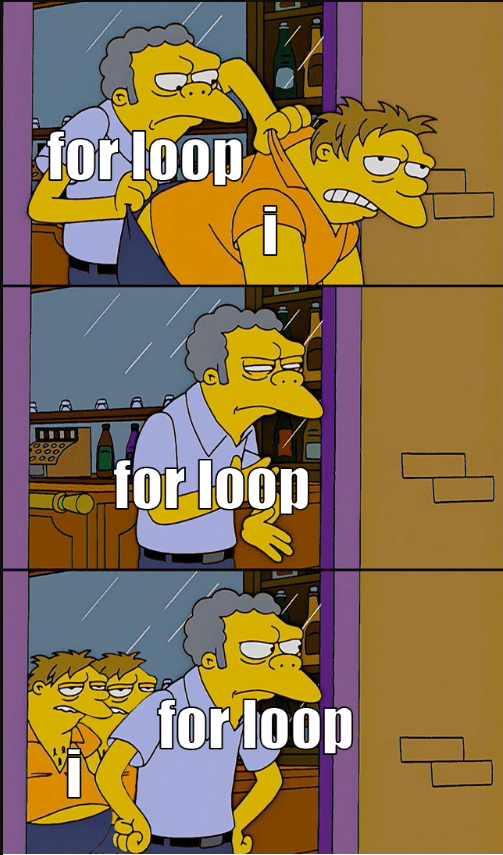

# Loops and Conditionals

```{=html}
<script src="https://kit.fontawesome.com/0e67562c4f.js" crossorigin="anonymous"></script>
<!-- <link rel="stylesheet" href="./img/fontawesome.min.css"> -->
```


## What is a loop?


- Loops are automations that take care of repetitive tasks
    - Typically, we might go through data row by row and perform a task
- Loops can have different forms:
    - **for**: loop over a pre-defined set of values, such as a number sequence
    - **while**: define constraints and keep loop running as long as they are met
    - **repeat**: loop repeats until broken (*I do not recommend this ever!*)
- For is most common, while is nice for more advanced simulations


### What are conditionals?


- Conditionals define different actions for different conditions
- They follow intuitive language:
    - **if**: define action to take when condition is met (logical)
    - **else if**: define action for another condition
    - **else**: define action for everything else
- **ifelse** is the shortcut-function we already got to know for recoding with `mutate()`
    - defines exactly 1 condition, 1 action, 1 alternative
    - expandable version of ifelse is case_when


## Exercise: What should I use?


1. I want to print numbers from 1 to 7!
    - for loop (but realistically *1:7* ;) )
2. I need to simulate more data as long as my sample size is smaller than 200!
    - while loop
3. I want to print the age of only the females in my sample!
    - if/ else
    


## for-loop

- In a for loop, we need to define the range *for* which the loop should run
- We define an *iterating variable* that will change each time the loop runs and take on all values of the defined range
    - Typically, we call this variable "i"
- We define the range in round brackets and all actions the loop should take in curly brackets

### Example

```{r iteration}
for(i in 1:4){
  print(paste("The iteration is", i))
}
```

### Conditionals: If - else

```{r if-else, eval = F}
if(variable == "value"){
  print("Do something")
} else if(variable == "other_value"){
  print("Do some other thing")
} else {
  print("Do anything else")
}
```

### Conditionals: If - else
#### Checking numbers |

We want to test whether numbers in a loop are divisible by 3. If they are, we will display "Divisible by 3", and if not, we will simply output the iteration number like before.

For that we will use the  modulo %% , which gives us the rest of a division. Let's try it out!


```{r modulo}
for(i in 1:4){
  if(i %% 3 == 0){
    print("Divisible by 3!")
  } else {
    print(i) 
  }
}
```

### Exercise

Use a for-loop to display your favorite numbers.
The numbers should be between 10 and 25.

If the number is divisible completely by 5, you should output "Divisible by 5!", if not please output the iteration number only.

`r hide("Solution")`

```{r mod_sol}
for(i in 10:25){
  if(i %% 5 == 0){
    print("Divisible by 5!")
  } else {
    print(i) 
  }
}
```

`r unhide()`

## Same function, different variables

```{r print-loop}
for(i in c("Sepal.Length", "Sepal.Width", "Petal.Length", "Petal.Width")){
  print(mean(iris[ , i]))
}
```

<br>

> Brainteaser <i class="fa-solid fa-lightbulb" style="color: yellow;"></i>:
What is the class() of i here?

`r hide("<i class='fa-solid fa-lightbulb' style='color: yellow;'></i>")`

character

`r unhide()`


### More sophisticated 

```{r}
vector <- c("Sepal.Length", "Sepal.Width", "Petal.Length", "Petal.Width")

for(i in 1:length(vector)){
  print(paste("The mean value of", vector[i], "is", 
              round(mean(iris[ , vector[i]]), 2)))
}
```

<br>

> Brainteaser <i class="fa-solid fa-lightbulb" style="color: yellow;"></i>:
And what is the class() of i now?

`r hide("<i class='fa-solid fa-lightbulb' style='color: yellow;'></i>")`

integer (numeric)

`r unhide()`


### With saving values

```{r}
vector <- c("Sepal.Length", "Sepal.Width", "Petal.Length", "Petal.Width")
means <- rep(NA, length(vector)) # create "empty" vector to fill

for(i in 1:length(vector)){
  print(paste("The mean value of", vector[i], "is", 
              round(mean(iris[ , vector[i]]), 2)))
  means[i] <- round(mean(iris[ , vector[i]]), 2)
}
```

### Exercise: Seminar Data

<br>

Please download an edited version of our seminar data from ILIAS. You will find it under _data_ as a zip folder. The dataset in it should have ".Rds" as a file ending. Read it in using:

```{r}
seminar <- readRDS("./data/seminar_data.Rds")
```

**Create a for-loop that saves the means of age, body height and technological skill from that seminar data in a vector named "seminar_means".**

Hint: I renamed the variables to make them nicer to work with, so check out names(seminar)!

### Solution

```{r}
vector <- c("v02_age", "v04_bodyheight", "v05_skill_tech")
seminar_means <- rep(NA, length(vector)) # create "empty" vector to fill

for(i in 1:length(vector)){
  seminar_means[i] <- round(mean(seminar[ , vector[i]]), 2)
}
```

### Checking What's Going On
#### browser()

- In order to break our loop and enter a "debugging" mode, we can add browser() to any loop like so:

```{r eval = F}
vector <- c("v02_age", "v04_bodyheight", "v05_skill_tech")
seminar_means <- rep(NA, length(vector)) # create "empty" vector to fill

for(i in 1:length(vector)){
  seminar_means[i] <- round(mean(seminar[ , vector[i]]), 2)
  browser()
}
```

- The loop will run the first iteration until browser is called and then pause


- It allows you to check in the console whether all variables look the way you want them to without having to wait for the loop to run
    - Or if there are errors/ warnings, you can check _when_ they occur by moving the browser() to a different location in the code
- To continue with the next iteration while in browser, type "c" into the console, "Q" to quit
    - The Esc key will also terminate the browser
- **Make sure you exit it** before continuing with anything else


<!-- # Conditionals -->

<!-- Let's go through the data set and print out every person's philosophy on the mind-body-problem. -->
<!-- We want to get different output depending on whether the person believes in the existence of a soul. -->
<!-- <br> -->
<!-- What elements do we need? -->

<!-- ## Elements -->

<!-- ::: incremental -->

<!-- - For each person: -->
<!-- - Check _if_ they believe in the soul -->
<!--     - If yes: Output "This person believes in the soul and"... -->
<!--     - If no: Output "This person does not believe in the soul and"... -->
<!--     - Else: Output "This person is unsure about the soul and"... -->
<!-- - Then check _if_ their philosophy is monistic, dualistic or unclear analogously -->
<!--     - If monistic: output "believes the m-b-relationship is monistic." -->
<!--     - If dualistic: output "believes the m-b-relationship is dualistic." -->
<!--     - Else: output "is unsure of the m-b-relationship." -->
<!-- - Loop that over each person! -->

<!-- ::: -->


<!-- Write nrow() on the board -->

## Loop with Conditional

In our seminar data, the **average body height is `r round(mean(seminar$v04_bodyheight), 2)` cm**. We want to create a loop that goes through all rows (all seminar students) and outputs their height and whether it is above or below average.

What do we need for that?

### Elements


- For each person:
- Check _if_ their body height is above average
    - If yes: Output "This person is taller than average with ..."
    - Else: Output "This person is less tall than average with..."
- Then paste the person's body height 
- Loop that over each person!


<!-- Write nrow(), print(), paste() on the board -->

`r hide("Solution")`

```{r}
for(i in 1:nrow(seminar)){
  if(seminar$v04_bodyheight[i] > mean(seminar$v04_bodyheight)) {
    print(paste("This person is taller than average with", seminar$v04_bodyheight[i], "cm."))
  } else {
    print(paste("This person is less tall than average with", seminar$v04_bodyheight[i], "cm."))
  }
}
```

`r unhide()`

### And a more complicated outlook...
#### What happens here?

```{r eval = F}
for(i in 1:nrow(seminar)){
  if(seminar$v11_soul[i] == "yes"){ # Check soul belief
    text1 <- "This person belives in the soul and"
  } else if (seminar$v11_soul[i] == "no") {
    text1 <- "This person does not belive in the soul and"
  } else { text1 <- "This person is unsure about the soul and" }
  
  if(seminar$v12_soul_phil[i] == "monism"){  # Check mind-body-philosophy
    text2 <- "believes the m-b-relationship is monistic."
  } else if (seminar$v12_soul_phil[i] == "dualism") {
    text2 <- "believes the m-b-relationship is dualistic."
  } else { text2 <- "is unsure of the m-b-relationship." }
  
  print(paste(text1, text2)) # Print text
}
```

### Result

```{r echo = F}
for(i in 1:nrow(seminar)){
  # Check soul belief
  if(seminar$v11_soul[i] == "yes"){
    text1 <- "This person belives in the soul and"
  } else if (seminar$v11_soul[i] == "no") {
    text1 <- "This person does not belive in the soul and"
  } else {
    text1 <- "This person is unsure about the soul and"
  }
  
  # Check mind-body-philosophy
  if(seminar$v12_soul_phil[i] == "monism"){
    text2 <- "believes the m-b-relationship is monistic."
  } else if (seminar$v12_soul_phil[i] == "dualism") {
    text2 <- "believes the m-b-relationship is dualistic."
  } else {
    text2 <- "is unsure of the m-b-relationship."
  }
  
  # Print text
  print(paste(text1, text2))
}
```


## Wrap-Up & Further Resources {-}

<i class="fa-solid fa-anchor" style="color: teal;"></i>
<ul style="color: teal;">

<li>For-Loops must have a defined sequence to run over, e.g. 1 to 4</li>
<li>For-loops are the most common in R and are fit for most tasks</li>
<li>Loops are a powerful tool to e.g. easily perform the same task many times</li>
<li>Conditionals give you control over different operations depending on your data</li>
<li>In combination, loops and conditionals are most useful</li>
<li>Don't forget to play and create fun loops!</li>
</ul>


<br>

<i class="fa-solid fa-book" style="color: orange;"></i>
<ul style="color: orange;">

<li>[For loops (W3 Schools)](https://www.w3schools.com/r/r_for_loop.asp/){target="_blank"}</li>
<li>[For loops (R bloggers)](https://www.r-bloggers.com/2015/12/how-to-write-the-first-for-loop-in-r/){target="_blank"}</li>
<li>[For loops (DataMentor)](https://www.datamentor.io/r-programming/for-loop){target="_blank"} Here are also links the the other types of loop and a visualization</li>
<li>[Loops in R (datacamp)](https://www.datacamp.com/tutorial/tutorial-on-loops-in-r){target="_blank"} Very thorough! :)</li>
<br>
<li>[dplyr Exercises](https://sjspielman.github.io/datascience_for_biologists/exercises/dplyr.html){target="_blank"} Great to keep practicing over the holidays :)</li>
</ul>

[Lightbot](https://lightbot.com/hour-of-code.html){target="_blank"}


{width="auto" height="600px"}

<figcaption style = "font-size: 7pt;">[https://medium.com/nerd-for-tech/what-are-for-loops-b7215db28e83](https://medium.com/nerd-for-tech/what-are-for-loops-b7215db28e83){target="_blank"}</figcaption>
