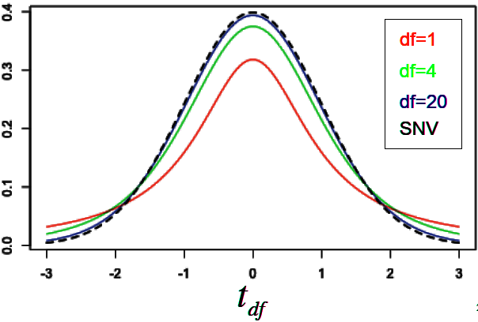
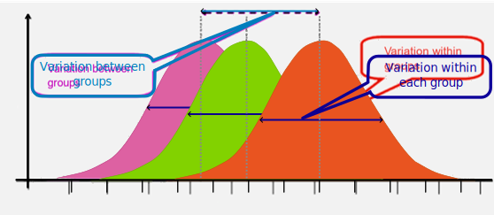

```{r include=FALSE, warnings = FALSE}
# knitr::opts_chunk$set(echo = T, include = T, warnings = FALSE)

# library(knitr)
library(papaja)
library(ggplot2)
library(dplyr)
library(unikn)

seminar <- readRDS("./data/seminar_data.Rds")
seminar$soul_dummy <- ifelse(seminar$v11_soul == "yes", 1, 0)
```

# Creating and interpreting statistics: Chi$^2$ & t-test & ANOVA
<!-- Remove Image and plot borders -->
<!-- Include jQuery -->
```{=html}
<script src="https://ajax.googleapis.com/ajax/libs/jquery/3.1.1/jquery.min.js"></script>
```

```{=html}
<script src="https://kit.fontawesome.com/0e67562c4f.js" crossorigin="anonymous"></script>
<link rel="stylesheet" href="./img/fontawesome.min.css">
```

<br>

- Re-cap of statistics: t-test, Chi$^2$ and ANOVA
- Learn how to calculate in R
- Learn how to check assumptions
- Go over examples (inspired by your thesis analyses <i class="fa-regular fa-face-smile"></i>)

## Statistics Re-cap <i class="fa-solid fa-graduation-cap" style="color: darkred;"></i> I

What do you remember from statistics: 

- What is Chi$^2$ / $\chi^2$?
- What is the t-test?
- What is an ANOVA?
- What do they have in common & what differentiates them?

### Statistics Re-cap <i class="fa-solid fa-graduation-cap" style="color: darkred;"></i> II

They measure _group differences_

- $\chi^2$ $\rightarrow$ nominal data
- t-Test $\rightarrow$ one or two _groups_ with a continuous attribute
- ANOVA $\rightarrow$ three or more groups with one (or more) continuous attribute(s)
    
```{r echo = F, fig.height=3.5}
uni_colors <- usecol(pal = pal_unikn_ppt, n = 6)[1:3] # das trickst den Mechanismus aus, der da weiß reinknallt

ggplot(iris, aes(x = Species, y = Sepal.Length, color = Species, fill = Species)) +
  geom_boxplot(alpha = .6) +
  labs(Y = "Sepal Length", title = "ANOVA: Lengths of Flower Petals") +
  scale_color_manual(values = uni_colors) +
  scale_fill_manual(values = uni_colors) +
  theme_apa() +
  theme(legend.position = "none")

```

### Pre-Requisites

<br>

- Load the seminar data using `seminar <- readRDS("./data/seminar_data.Rds")`
    - Please make sure you are using the R dataset from the <br>
    zip folder in ILIAS, not the original csv file we first used!
- Add a "dummy variable" (only two possible values 0 and 1) <br>
for believing in a soul, where 1 means _yes_ and 0 means _no or unsure_
    - `seminar$soul_dummy <-` <br>
    `ifelse(seminar$v11_soul == "yes", 1, 0)`

 
## $\chi^2$

- $\chi^2$ Test for Independence: Determines if there is an association between **two categorical variables** in a contingency table
    - compares the observed frequencies in each category of a contingency table to the frequencies expected if the variables were independent

k

### Calculation: 

- $$\chi^2 = \sum \frac{(O_i - E_i)^2}{E_i}$$

- \( O_i \) is the observed frequency in each category
- \( E_i \) is the expected frequency in each category, calculated as: $$E_i = \frac{(row \ total) \times (column \ total)}{grand \ total}$$

- Example: Believing in the soul by gender
- 
  ```{r echo = F}
  addmargins(table(seminar$v01_gender, seminar$soul_dummy))
  ```

### How to in R

- The `chisq.test()` function only needs (categorical!) _x, y_ as input
    - Especially with a small sample, we can add the parameter _simulate.p.value = T_, which bootstraps the analysis 2000 times
    
- 
  ```{r}
  chisq.test(seminar$v01_gender, seminar$soul_dummy, simulate.p.value = T)
  ```

### Exercise <i class="fa-solid fa-ghost" style="color: #dcdcdc;"></i> <i class="fa-solid fa-music"></i>

<br>

We want to explore whether **belief in the soul (dummy)** is associated with **music preference**. 

<br>

Calculate a simple chisq.test and interpret the results.

### Solution <i class="fa-solid fa-ghost" style="color: #dcdcdc;"></i> <i class="fa-solid fa-music"></i>

```{r}
chisq.test(seminar$v07_genre, seminar$soul_dummy)
addmargins(table(seminar$v07_genre, seminar$soul_dummy))
```

- Interpretation? 
<!-- There is no significant association between belief in the soul and music preference by genre. -->

## t-Test

- There are 3 broad categories of t-test:

- **one-sample** t-test:
    - Test one sample against a known mean value
- **two-sample** t-test (independent):
    - Test two sample-means against each other (independent samples)
- **paired two-sample** t-test:
    - Test two dependent sample-means against each other (e.g. repeated measures)
    
### Test statistic _t_ 

- Test statistic T has a known distribution that depends on the **degrees of freedom**, calculated as n-1
- Most (probable) T values are around 0
    - The further away the T value is from 0, the less likely it is caused by chance alone $\rightarrow$ _significance_




### Test statistic _t_ 

- One sample: $$ t = \frac{\bar{X} - \mu}{\frac{s}{\sqrt{n}}} $$

- Two sample: $$t = \frac{\bar{X}_1 - \bar{X}_2}{\sqrt{\frac{s_1^2}{n_1} + \frac{s_2^2}{n_2}}} $$

### How to in R

- The basic function is `t.test()` for any type of t.test
- One sample needs inputs _x, mu_ (if x is from a data set you should specify _data_)
- Two sample needs either
    - _x, y_ (if from data set, _data_) or
    - _x ~ group_ (if from data set, _data_)
- Paired test needs _paired = T_
- One-sided test needs _alternative = 'greater'_ (assumes first group mean to be larger than second; otherwise "less")

### Examples

```{r}
# One sided - "greater" assumes that mean(x) is larger than mean(y)
t.test(x = 10:20, y = 0:10, alternative = "greater")

# Two sided using formula ~ Does seminar motivation differ
# depending on the soul-belief of students?
t.test(v10_motivation ~ soul_dummy, data = seminar)
```

### Exercise <i class="fa-solid fa-computer"></i> 

<br>

We want to test whether the **gender** stereotype that men are **more skilled with technology** appears in our seminar sample.

<br> 

Perform a one-sided two-sample t-test and interpret the results.

<br>

Hint: The grouping variable "v01_gender" is sorted alphabetically - so choose the "alternative" accordingly!

### Solution <i class="fa-solid fa-computer"></i> 

```{r}
t.test(v05_skill_tech ~ v01_gender, data = seminar, alternative = "greater")
```

- Interpretation?
    - There are no significant gender differences in technological skill.


<!-- # ```{r} -->
<!-- # # remotes::install_github("tpepler/nonpar") -->
<!-- # nonpar::boot.t.test(seminar$v05_skill_tech[seminar$v01_gender == "man"],  -->
<!-- #                     seminar$v05_skill_tech[seminar$v01_gender == "woman"],  -->
<!-- #                     reps = 1000, -->
<!-- #                     alternative = "greater" -->
<!-- #                     ) -->
<!-- # ``` -->


## ANOVA


  

- Like a t-test for more than two groups
- Why do we not just calculate several t-tests?
    - $\alpha$ inflation! 
    - Significance level of 0.05 means that 1/20 tests will be significant by pure chance, so more tests makes it more likely that we hit that chance and make an alpha error (falsely reject null hypothesis)
  
### How to - theoretically

1.  Check Assumptions
    - Data should be normally distribution & variance in groups should be similar (homogeneous)
2. Sum of Squares: Sum of Squares total, within & between (_R does this for us_)
    - F-fraction as the measure of variance explained by the grouping variable in comparison to other variability in the dependent variable
3. Interpretation and post-hoc tests
    - If there are any significant differences at all, we can use pairwise t-tests (with alpha correction!)

### Example: Music genre and loudness <i class="fa-solid fa-music"></i>
#### 1. Check assumptions

- Check for Homogeneity of Variance with the Levene Test
- 
  ```{r}
  # Make sure the package "car" is installed first! If not, install.packages("car")
  # as.factor() forces R to recognize our group as such!
  car::leveneTest(v08_loudness ~ as.factor(v07_genre), data = seminar, center = mean)
  ```

- Interpretation?
    - p value < 0.05 would indicate significant differences in variance between the group, so we want it to be > 0.05
    - Assumption met! <i class="fa-regular fa-face-smile"></i>
    
#### 2. Define the overall model

```{r}
model <- aov(v08_loudness ~ as.factor(v07_genre), data = seminar)
summary(model) # "Pr(>F)" is the p-value
```

- Interpretation?
    - Not significant (likely due to small sample size)
    - usually we would stop here then, but we will look at the post hoc tests anyway ;)
    
#### 3. Post Hoc Test 

```{r}
TukeyHSD(model)
```

- Interpretation?
    - There are no significant pairwise differences in our (small) sample.
    - But we can simulate a larger sample (for fun)

### Addendum for demonstration only: Bootstrapped Data for larger sample size

```{r}
data <- data.frame()

for(i in 1:10){
  boot <- seminar[sample(1:nrow(seminar), nrow(seminar), replace = T), ]
  data <- rbind(data, boot) # create many random samples from our data 
}

bootstrapped_model <- aov(v08_loudness ~ as.factor(v07_genre), data = data)
summary(bootstrapped_model)
TukeyHSD(bootstrapped_model)
```


## Reporting with the `apa` & `papaja` packages

<br>

- You know the `papaja` package already for `theme_apa()` in data visualization
- The package also has many wrapper functions to make reporting in R & R Markdown a lot easier
    - "apa_print()" 
    - Chi$^2$ Test reporting cannot be achieved with this, so we use apa::chisq_apa() for that

### Usage

```{r}
# Chi (add format = "rmarkdown" if needed)
apa::chisq_apa(chisq.test(seminar$v07_genre, seminar$soul_dummy))

# t-test
papaja::apa_print(t.test(v05_skill_tech ~ v01_gender, data = seminar, alternative = "greater"))$full_result

# ANOVA
papaja::apa_print(model)$full_result
```

### Usage in R Markdown

- This presentation is based on R Markdown, so we can make use of the pretty printing options right here
- By using `apa_print(model)$full_result`, we can automatically report results inside our documents:

- "In our sample, ANOVA showed no significant differences between preferred music genre and preferred volume of listening to music (`r apa_print(model)$full_result`). However, bootstrapping with 10 repetitions suggests that this lack of evidence might be due to the small sample size (`r apa_print(bootstrapped_model)$statistic`), which is also supported by the large effect size (`r apa_print(bootstrapped_model)$estimate`)."


 
## Wrap-Up & Further Resources 
 
<i class="fa-solid fa-anchor" style="color: teal;"></i>
<ul style="color: teal;"> 
<li>Chi$^2$ test measures association between two categorical variables </li>
<li>t Test measures differences between mean values (one sample, two sample, paired)</li>
<li>ANOVA can be thought of as an augmentation of the t test while controlling alpha inflation</li>
<li>Functions: chisq.test(), t.test(), aov()</li>
<li>Always try to imagine/ keep in mind what you might expect and _what the data would be like if that were true_</li>
<li>Read the documentation of each function for more options</li>
</ul>


<br>

<i class="fa-solid fa-book" style="color: orange;"></i>
<ul style="color: orange;">
<li> [Statistics Picker](https://the-tave.shinyapps.io/Statistics-Picker/)</li>
<li> [Chi2-test (Statology)](https://www.statology.org/chi-square-test-of-independence-in-r/) </li>
<li> [t-test (Statology)](https://www.statology.org/two-sample-t-test/) </li>
<li> [ANOVA (Statology)](https://www.statology.org/interpret-anova-results-in-r/) </li>
</ul>

## <i class="fa-solid fa-house-chimney" style="color: darkgreen;"></i> Homework: R Markdown

Some of you are already somewhat familiar with R Markdown. 
For those of you who are not, please create a demo RMarkdown document and "knit" it. 
{#id .class width=auto height=140px} ... or go to File > New File > R Markdown to create a new Rmd document. 
Give it a name or keep all the defaults.
It will create a document with some demo content.
When you click the "knit"-button below the main menu, you will need to save the file and it will create the output.
Try to play around with the text and read the demo content - it explains the basic functions!


## Thank you!

<br>

{#id .class width=auto height=430px}
