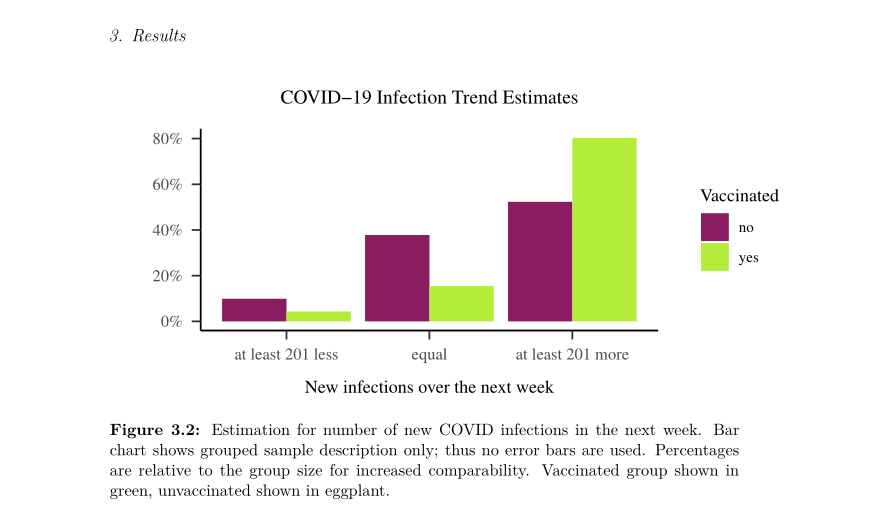
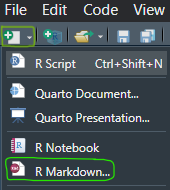

# Intro to R Markdown

```{=html}
<script src="https://kit.fontawesome.com/0e67562c4f.js" crossorigin="anonymous"></script>
<!-- <link rel="stylesheet" href="./img/fontawesome.min.css"> -->
```


## Creating whole documents in R

- Creating visualizations and statistics in R is great, but we need to able to show and report our work.
- Results can be copied and plots can be exported, but they can also be embedded directly into a document in R
- R Markdown is a text engine based on $\LaTeX$ that allows you to create documents, presentations, reports...

{height=250px}

### Example

Please create a demo RMarkdown document and "knit" it. 
{#id .class width=auto height=140px} ... or go to File > New File > R Markdown to create a new Rmd document. 
Give it a name or keep all the defaults.
It will create a document with some demo content.
When you click the "knit"-button below the main menu, you will need to save the file and it will create the output.
Try to play around with the text and read the demo content - it explains the basic functions!

You can use the document you create now as a sort of cheatsheet and template for what you can do later.


## Document Basics

<br>

- RMarkdown has some basics that need to be learned
- It also has many features and powerful tools for layout and styling
- By default, RMarkdown can create html documents - if you want a pdf, you need a special package to render $\LaTeX$, I recommend `tinytex`
    - `install.packages("tinytex")`
    - `tinytex::install_tinytex()`

### YAML header (_Yet Another Markdown Language_)

- This defines the output format of our document, e.g. `html_document`
- We can set our title, subtitle, author, date... 
- We can define further characteristics, e.g. `toc` (table of content) or `self-contained` (this should be set to true, otherwise R will not copy images etc. and the document will not work properly on other devices)

- <i class="fa-solid fa-lightbulb" style="color: purple;"></i> <i style="color: purple;">
The YAML header needs to be indented in a certain way, otheriwse the commands are not recognized! </i>
- <i class="fa-solid fa-lightbulb" style="color: purple;"></i> <i style="color: purple;">
In the YAML header, `true` and `false` are not capitalized, unlike in the rest of R! </i>
    
### Markdown Basics

<br>

Text formatting generally works with characters in the text:

- _italics_ with \_italics\_
- **bold** with \*\*bold\*\*
- **_bold and cursive_** with \*\*\_bold and cursive\_\*\*
- Unordered lists are created with \-
- Ordered lists with 1., 2. ...

## \#\# Heading Basics
### \#\#\# Sub Header 3. level
#### \#\#\#\# 4th level
##### \#\#\#\#\# 5th level
###### \#\#\#\#\#\# 6th level

Thats's it.

Realistically, we _may_ want to go down to the 4th level heading, but usually no further.

## Special Features

- Print mathematical equations
- Show code and its output
- Easily use automatic formatting
- Profit from existing templates
- General rule of thumb: Rmd documents are rendered depending on their output format
    - If you plan on creating an html, you can use plain html to make adjustments and use special features.
    - If you create a pdf, they will most likely not work and you should use $\LaTeX$ notation.

### $\LaTeX$

Especially useful for writing equations:

- \$ \\ alpha \$ $\rightarrow$ $\alpha$
- \$ \\ beta \$ $\rightarrow$ $\beta$
- \$ R^2 \$ $\rightarrow$ $R^2$
- and, by the way,  \$ \\ rightarrow \$ becomes $\rightarrow$ 
- and \$ \\ LaTeX \$ becomes $\LaTeX$
- \\ newline creates a new line and \\ newpage creates a new page
    
### HTML

Remember these tags should only be used when creating a html document!

- \< br \> creates a new line (stands for "line break")
- \<span style="color: purple;"\> This text will appear purple. \</span\> 
    - <span style="color: purple;"> This text will appear purple. </span> 
- Simple tables can be created with html notation in most documents
    - Header 1 | Header 2
    - _then a row of - - - | - - - to represent the lines_
    - And the content separated | into as many columns as defined
    
### Table Example

<br>

Header 1 \| Header 2 <br>
-----\|----- <br> 
Great content \| Fantastic content <br>

<br> Becomes: <br>

Header 1 | Header 2 
-----|-----
Great content | Fantastic content


## Including R

<br>

- Including R code can be achieved by either inserting so-called code chunks or using inline code
- Code chunks are useful if several lines of code need to be evaluated and/ or shown 
    - There are many options for code chunks
- Inline code is useful if single outputs are to be shown
    - E.g. with functions you already know such as `apa_print()`

### Code Chunks

- Code chunks are inserted via the menu Code > Insert Chunk and should look like this:
- \```{r} <br>
  \# _code goes here_ <br>
  \```
- 
  ```{r}
  # code goes here
  ```
- Or you can use the keyboard shortcut ctrl + alt + i / command + option + i

#### Chunk Options {-}

- Inside the curly brackets, you can specify many different options, for example: 
    - `fig.height = 3` will output a plot to a certain height (3 inches)
    - `echo = F` will show code output, but not the code
    - `eval = F` will show the code, but not its' output...
- eval = F:
  ```{r eval = F}
  head(iris, 1) 
  ```
- echo = F:
  ```{r echo = F}
  head(iris, 1)
  ```

##### `error = TRUE` {-}

- This option allows us to include erroneous code in our script
- It will output the error message just like you would see in your R Studio console
- By default, `error = FALSE` which means that your script cannot be rendered with errors in code chunks

```{r error=TRUE}
mean(y)
```

## Wrap-Up & Further Resources {-}
 
<i class="fa-solid fa-anchor" style="color: teal;"></i>
<ul style="color: teal;"> 
<li> RMarkdown allows you to create professional documents</li>
<li> You can use it like other text-generating programs (e.g. MS Word)</li>
<li> Embed plots, code and statistical results directly in your document</li>
<li> Show equations and use other special features</li>
</ul>

<br>

<i class="fa-solid fa-book" style="color: orange;"></i>
<ul style="color: orange;">
<li> [YouTube: What is R Markdown?](https://www.youtube.com/watch?v=asHhuHRxhvo&ab_channel=EquitableEquations/)</li>
<li> [LaTeX Cheatsheet](https://wch.github.io/latexsheet/)</li>
<li> [HTML Cheatsheet](https://web.stanford.edu/group/csp/cs21/htmlcheatsheet.pdf)</li>
<li> [RMarkdown Cookbook](https://bookdown.org/yihui/rmarkdown-cookbook/)</li>
<li> [RMarkdown Chunk Options](https://yihui.org/knitr/options/)</li>
<li> [YouTube: Presentations with Quarto](https://www.youtube.com/watch?v=01KifhHDkFk&ab_channel=EquitableEquations)</li>

</ul>


{height=550px}