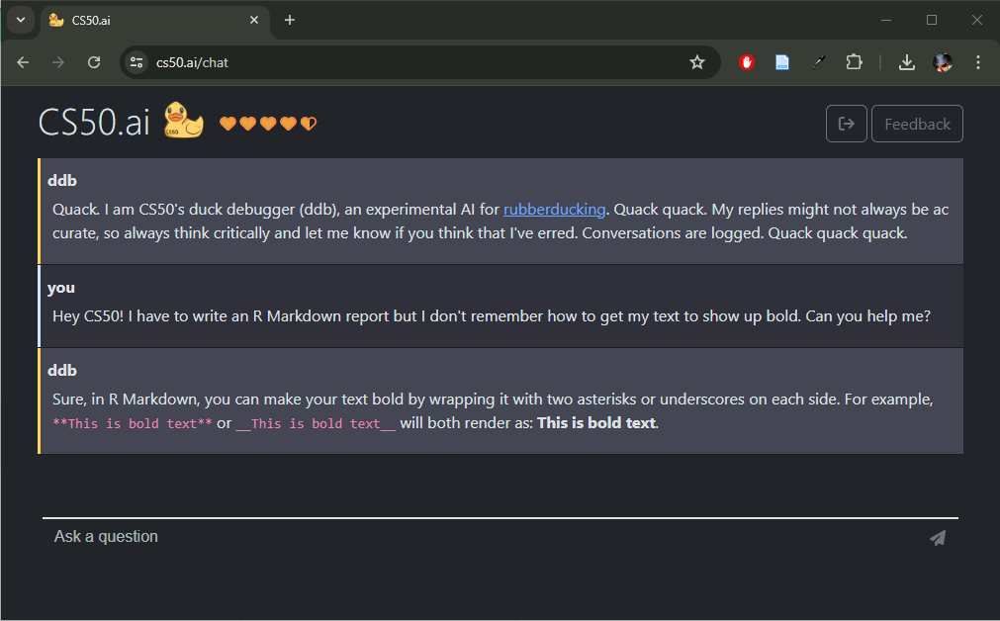

# Wrap Up {-}

```{=html}
<script src="https://kit.fontawesome.com/0e67562c4f.js" crossorigin="anonymous"></script>
<!-- <link rel="stylesheet" href="./img/fontawesome.min.css"> -->
```

If you have made it this far in the book, you should now posses the tools necessary to tackle most R tasks and more importantly, you should be able to teach yourself new skills.

In these last two Chapters I will  share some last pieces of wisdom that may inspire you to keep learning R. 
you will also find a collection of exercises and quiz questions to review your knowledge and hopefully have fun remembering it! 
Personally, I got started because I had super talented people to learn from that I am glad to call my friends still today (Tobi, Lukas, Kilian - looking at you guys <i class="fa-regular fa-heart" style="color: #B197FC;"></i>).

If you found this book helpful and want to thank me or you have some suggestions or wishes for the future, please write me an email! 
I hope to keep improving this intro and possibly adding to it, so I would also love to get some contributions!

`r hide("<a href='mailto:annika-tave.overlander@uni.kn'> <i class='fa-solid fa-envelope' style='color: purple;'></i> </a>")`
`r unhide()`

So, here are my last pieces of wisdom inspired by things I learned and people I met at the [useR! conference 2024](https://events.linuxfoundation.org/user/):

## Many people are working on many great projects.{-}

```{r}
ohwhaley::say("Thanks to Fonti Kar for this sweet whale package!")
```

## R can be hard. {-}

Which is why it's important to know a couple of tools to make your life easier.
Generally, I am hesitant to recommend using AI such as ChatGPT to help with coding, as it can be even more frustrating when this artificial companion suggests code that cannot work, cannot solve your problem, or simply confuses you even more.
Therefore, I suggest you have a look at [cs50.ai](cs50.ai), an AI developed to help with coding troubles by the Harvard university.

{height=300px}

## ... but it's worth it. {-}

R has a steep learning curve at the beginning, which can be frustrating but also means that it will keep getting easier to expand your skills.
For everyday use, i.e. calculating statistics and creating visualizations, R is already great. 
But it is possible to go much further: R has integrations for word processors (you've heard of LaTeX in R Markdown), building websites and apps ([Shiny](https://shiny.posit.co/r/getstarted/shiny-basics/lesson1/index.html)), creating presentations ([Quarto](https://quarto.org/docs/get-started/hello/rstudio.html)) and of course anyone can contribute to the community with new packages.
Try to stay curious and see if any of these features might be of use to you at some point! 
Maybe you need to report a lot of your code and show visualizations in your thesis - why not write it in R Markdown?

## R is really fun! {-}

There are many reasons why so many people in so many fields of expertise choose this weird language^[I highly recommend this lovely talk on [keeping R weird](https://youtu.be/KOQBfC1WPwM?si=M_eStpWXBf56UGy7) by Kelly Bodwin.] as their primary means of communication.
One of them is definitely the powerful yet sometimes completely silly and useless things you can do with it (Thanks to Scott Chamberlain and Amanda Dobbyn for the package!):

```{r echo = T}
cowsay::say("What the duck is this?", by = "duck")
```


<!-- ## "Pub" Quiz - Which function is missing? & Logos -->

<!-- Work in groups of 2-3 and submit your answers via kahoot.  -->

<!-- You will see some code snippets where the function name is missing - which is it?  -->

<!-- Afterwards you need to judge which package logo is the right way round! -->


<!-- <small> Big Thanks to Deepansh Khurana for providing materials and inspiration! </small> -->

<!-- LINK HERE  -->

## Outlook {-}

Keep teaching yourself R - you have a lot of great resources!
And keep an open mind to keep finding cool features, such as the `emphatic` package, which lets you color rows in tables very easily. 


```{r emphatic}
iris |> 
  group_by(Species) |> 
  summarize(Mean_Sepal_Length = mean(Sepal.Length)) |> 
  emphatic::hl(c("purple", "violet", "hotpink"))
```


<i class="fa-solid fa-anchor" style="color: teal;"> Wrap-Up </i>
<ul style="color: teal;"> 
<li> R helps you to get an overview of your data </li>
<li> R gives your tools for data analysis & visualization </li>
<li> R lets you create reports, presentations, app dashboards... </li>
<li> Keep R weird! Do silly things in R! </li>
<li> Use the slides from this course as templates to learn from. <i class="fa-solid fa-copy"  style="color: teal;"></i> </li>
</ul>


<br>

<i class="fa-solid fa-book" style="color: orange;"> Further Resources </i>
<ul style="color: orange;">
<li> [StatLearning Shiny App (Uni Leiden)](https://solo-fsw.shinyapps.io/NewStatLearning/)</li>
<li> [GitHub: Ohwhaley package](https://github.com/fontikar/ohwhaley)</li>
<li> [YouTube: useR! conference](https://www.youtube.com/@useRConference_global) </li>
</ul>

# Practice{-}

## Loops: Write a for-loop that outputs the first X numbers of the Fibonacci sequence ("golden ratio")

{height=200px}

The Fibonacci sequence is defined as a sequence in which each number is the sum of the two proceeding ones.
That means, starting at 1 the sequence is: 1, 1, 2, 3, 5, 8, 13...
Please create it for the first 15 numbers in the Fibonacci sequence and save the numbers to a variable called _fibonacci_.

More info: [https://en.wikipedia.org/wiki/Fibonacci_sequence](https://en.wikipedia.org/wiki/Fibonacci_sequence).

`r hide()`

```{r fibonacci}
n <- 15

# Simple and clear
fibonacci <- c(1, 1, rep(NA, n-2))

for(i in 3:n){
  fibonacci[i] <- fibonacci[i-1] + fibonacci[i-2]
}
fibonacci

# Alternative with while loop
fibonacci = c(1, 1)

while(length(fibonacci) < n){
  new_num <- fibonacci[length(fibonacci)] + fibonacci[length(fibonacci) - 1]
  fibonacci <- c(fibonacci, new_num)
}
fibonacci
```

`r unhide()`


## RMarkdown: Start your document in a certain way that matches the template!

<br>

Look at the example document shown below and try to re-create it!
Be mindful of which elements need to be defined in the YAML header and which need to be modified in the text.

{height=550px}

`r hide()`

```{r rmdexercise, eval = F}
---
title: "Exercise 1"
author: "A great author"
date: "2024-07-02"
output: 
  pdf_document:
    toc: true
---

# First Chapter

Some text in **bold**.

## A subchapter

Some text in _cursive_.

# Second Chapter

Here is an overview of the iris dataset:

``{r} # make sure to include three ` here!
head(iris, 3)
``
```


`r unhide()`


<div class="tenor-gif-embed" data-postid="11365139" data-share-method="host" data-aspect-ratio="1.42857" data-width="60%"><a href="https://tenor.com/view/hadley-wickham-rstats-typing-rcode-gif-11365139">Hadley Wickham GIF</a>from <a href="https://tenor.com/search/hadley-gifs">Hadley GIFs</a></div> <script type="text/javascript" async src="https://tenor.com/embed.js"></script>


# Toolbox {-}

The toolbox contains a collection of nifty tips, tricks and hacks for anything R.

## Keyboard shortcuts to make your life easier {-#shortcuts}

| Function              | Shortcut PC / Mac                  |
|-----------------------|------------------------------------|
| Run current line      | Ctrl + Enter / Cmd + Return        |
| Add \<-               | Alt + - / Option + -               |
| Add %\>%              | Ctrl + Shift + M / Cmd + Shift + M |
| Show help             | F1                                 |
| Options for auto-fill | Tab                                |
| Create New Script     | Ctrl + Shift + N / Cmd + Shift + N |
| Comment out line      | Ctrl + Shift + C / Cmd + Shift + C |
| Save your script      | Ctrl + S / Cmd + S                 |

## Reading in Data {-}

Data Source | R command
------|------
WEXTOR (CSV) | `readr::read_delim("data.csv", delim = ";")`
Excel (XLSX) | `xlsx::read.xlsx("data.xlsx", sheetIndex = 1)`
R Data Source (RDS) | `readRDS("data.Rds")`
SPSS (SAV) | `foreign::read.spss("data.sav")`

## Logic {-}

Symbol | Meaning
-------|--------
< | smaller than
<= | smaller or equal
\> | greater than
\>= | greater or equal
== | equal to
!= | unequal to
TRUE | true (also written T)
FALSE | false (also written F)
`tidyselect::between(x, left, right)` | is x between the left and right value?
`tidyselect::contains(match)` | selects columns whose names contain a word (to be used with `dplyr::select()`)
& | AND (both must be TRUE)
\| | OR (just one must be TRUE)
! | NOT (as in != NOT equal)